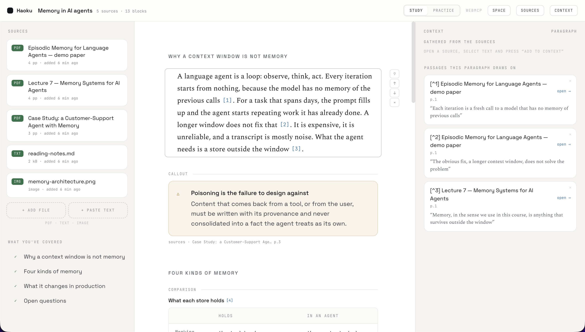

# Haoku

A knowledge workspace for studying with an agent. You bring the sources; the agent writes the
document with you and turns it into questions to drill, and every claim points back at the passage
it came from.



**Study** is three columns:

- **Sources** — PDFs, text files, images, or text you paste (with the URL it came from). Everything
  stays in the browser, in IndexedDB. No server, no upload.
- **The sheet** — one Markdown document, shown as blocks: headings, paragraphs, tables, images,
  callouts and diagrams. Interactive blocks are `<space-*>` web components embedded in the Markdown,
  so an exported `.md` still works outside the app.
- **Context** — where the selected block comes from: the passages it cites, and the ones you have
  gathered from the sources but not used yet.

**Practice** is the other half: multiple-choice questions the agent writes from those same passages,
asked weakest first, with your progress kept alongside the document.

Citations are standard Markdown footnotes. `[^3]` in the text, and at the end of the document:

```markdown
[^3]: [episodic-memory.pdf, p. 2](space://s_2bf3b723/2) — "a summariser that produces a one- or two-sentence description"
```

Clicking the passage in Context opens the source at that page with the quote highlighted.

## WebMCP: the agent is not in the app

Haoku has no chat box. It exposes its own UI as **tools over [WebMCP](https://github.com/webmachinelearning/webmcp)**,
and the agent you already use in your browser drives it: it reads your sources, writes into the
sheet, opens a PDF at the page it is talking about, and adds practice questions.

On load the app registers 20 tools on `document.modelContext` (falling back to the deprecated
`navigator.modelContext`), and the `webmcp` chip in the top bar turns on with the count. WebMCP
needs a secure context, so HTTPS or localhost.

The full reference, with what each tool returns, is in [webmcp.md](webmcp.md).

| | tools |
|---|---|
| Sources | `list_sources`, `search_sources`, `read_source`, `open_source`, `highlight_source` |
| The sheet | `get_workspace`, `set_title`, `add_block`, `update_block`, `remove_block`, `move_block`, `focus_block`, `link_sources` |
| The user | `get_selection` — the selected block, the text under the cursor, the open source · `list_context` — the gathered passages, free ones apart from the ones the document already cites |
| Practice | `add_practice`, `list_practice`, `remove_practice` |
| History | `undo`, `redo` |

Three things shape the catalog:

- **A tool cannot invent a citation.** Every passage an agent cites is resolved against the stored
  file: the quote has to be there, and the tool answers with the page and the exact text it matched,
  or with an error explaining what to fix. Nothing reaches the document unattributed.
- **Each passage backs one block.** What the user gathered in the context is what a new block is
  built from, and it is used by default; a passage another block already cites is refused.
- **Errors are data.** A failing call returns `{ ok: false, error, hint }` with the shapes and ids
  the agent got wrong, so it can correct itself instead of guessing.

Every call is visible: a floating badge shows what is running and the last five results.

### Driving the tools without an agent

The same catalog is on `window.haoku.tools`, which is how the app is tested from the console:

```js
await window.haoku.tools.call('add_block', {
  type: 'paragraph',
  content: { text: 'Every call to a model starts from nothing [1].' },
  citations: [{ source: 'memory-systems-lecture-notes.pdf', quote: 'starts from nothing' }],
})

window.haoku.tools.list()    // name, title, description, inputSchema
window.haoku.tools.status()  // { supported, api, registered, failed, error }
```

## Running it

Node 22 or newer.

```bash
npm install
npm run dev
```

Then open http://localhost:5173. With no sources, the left panel offers **load demo project**: five
sources on memory in AI agents (three short papers written for the demo, a page of notes and a
diagram), a document that cites four of them, and the practice questions that go with it.

The other scripts:

| script | what it does |
|---|---|
| `npm run dev` | the Vite dev server |
| `npm run build` | typecheck, build the standalone `space-*` bundle, then build the app |
| `npm test` | vitest over the Markdown layer (parse, serialize, citations, migrations) |
| `npm run lint` | oxlint |
| `npm run preview` | serve the production build |
| `npm run deploy` | build and publish to Cloudflare Workers |

## Analytics

None by default. `startAnalytics()` loads Google Analytics only when a measurement id is present at
build time and the app is not on localhost:

```bash
VITE_GA_ID=G-XXXXXXXXXX npm run build
```

It reports the page view and nothing else. The sources and the document never leave the browser.

## Exporting

- **`.md`** — the document with its footnotes renumbered. Interactive blocks keep working in any
  Markdown renderer that allows HTML if `space-elements.js` is on the page; `public/elements-demo.html`
  is a working example.
- **A zip** — `document.md`, `space.json` (title, highlights, practice bank, source metadata), the
  source files themselves, and the `space-*` bundle. Importing it restores the space, including old
  exports from earlier versions of the format.
- **Print / PDF** — the document with every passage it cites listed underneath.

## Layout of the code

```
src/
  workspace/     the document as Markdown: parse, serialize, citations, storage, exchange
  workspace/markdown/  the whole format, framework-free and unit-tested
  elements/      the <space-*> web components, also built as a standalone bundle
  components/    the three columns, the source viewer, the practice view
  tools/         the WebMCP catalog and the bridge
  reader/, pdf/  the PDF reader (pdf.js) with persistent highlights
```

Deployment is a Cloudflare Worker serving the built assets: `worker.js` and `wrangler.jsonc`.

## License

MIT. See [LICENSE](LICENSE).
